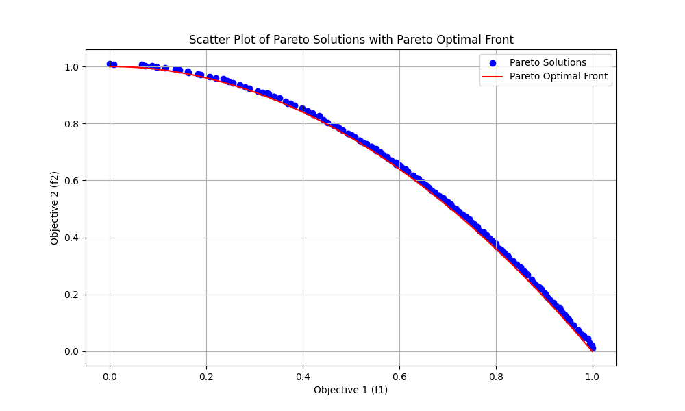

Here's a sample **GitHub README** for your project:

---

# NSGA-II with Comet Integration for ZDT2 Problem

This repository implements the **Non-dominated Sorting Genetic Algorithm II (NSGA-II)** to solve the ZDT2 multi-objective optimization problem. The project includes integration with [Comet](https://www.comet.com/) for tracking experiments, metrics, and visualizations.

---

## 📋 Features

- Implementation of **NSGA-II** for multi-objective optimization.
- Solving the **ZDT2 problem** and **Comet Problem** with its non-convex Pareto front.
- Easy-to-use modular code structure for customization.

---

## 🧰 Requirements

- Python 3.8 or higher
- Libraries:
  - `numpy`
  - `matplotlib`

Install dependencies using:

```bash
pip install -r requirements.txt
```

---

## 🚀 Getting Started

### Clone the Repository

```bash
git clone https://github.com/rikunz/NSGA-IIgit
cd NSGA-II
```


### Run the Code

```bash
python comet.py
```

This will execute the NSGA-II algorithm on the ZDT2 problem and log the experiment results to Comet.


## 🖼 Sample Results

### Pareto Front Progression




## 🤝 Contributions

Contributions are welcome! Feel free to open issues or submit pull requests.

---


## 📧 Contact

For questions or feedback, please reach out at [thoriqfirdaus8@gmail.com](thoriqfirdaus8@gmail.com).

---

Let me know if you’d like to customize any specific sections!
